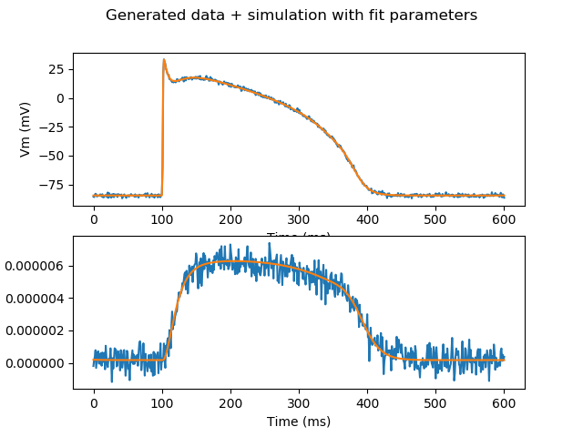

↩ Back to [index](../README.md)

# Whole-cell conductances

- [Models are written in Myokit's MMT syntax](https://myokit.readthedocs.io/syntax/index.html), usually by [downloading a CellML model](https://models.cellml.org/electrophysiology) and then [importing it](https://myokit.readthedocs.io/api_formats/cellml.html).
- [Simulations are run](https://myokit.readthedocs.io/api_simulations/Simulation.html) using the `Simulation` class, which uses CVODE to solve the ODEs.
  - For ion-channel stuff with piecewise constant voltage-step protocols (no ramps or sine waves) it's usually faster to use Myokit's [Hodgkin-Huxley model](https://myokit.readthedocs.io/api_library/hh.html) or [Markov model](https://myokit.readthedocs.io/api_library/markov.html) classes to run analytical simulations)
- [A pints.ForwardModel](https://nbviewer.jupyter.org/github/pints-team/pints/blob/master/examples/writing-a-model.ipynb) is wrapped around a Myokit simulation.
- [A pints.ErrorMeasure](https://pints.readthedocs.io/en/latest/error_measures.html) or [pints.LogLikelihood](https://pints.readthedocs.io/en/latest/log_likelihoods.html) is defined
- [Optimisation](https://nbviewer.jupyter.org/github/pints-team/pints/blob/master/examples/optimisation-first-example.ipynb) or [Bayesian inference](https://nbviewer.jupyter.org/github/pints-team/pints/blob/master/examples/sampling-first-example.ipynb) is run.

This example shows how to fit several conductances to a multi-output data set (voltage and calcium transients).

